# 🛒 Data Digger
### E-Commerce Relational Database Project | MySQL

<p align="center">
  
  
  
  
</p>

<p align="center">
  A practical MySQL project exploring how an e-commerce store can organize,
  connect, and query its data.
</p>

---

## 📌 Project Overview

**Data Digger** is a relational database project based on a simple e-commerce store. It demonstrates how customer, order, product, and order-detail data can be stored in related tables and queried using SQL.

The project practices table creation, primary and foreign keys, CRUD operations, filtering, sorting, joins, date-based queries, and aggregate functions.

## 🎥 Project Video Walkthrough

The project video should be saved in the repository folder as **`Data-Digger-Demo.mp4`**.

[▶ Watch the Data Digger project video](Data-Digger-Demo.mp4)

> If your video has a different filename, update the link above to match it. You can also replace the link with a shareable YouTube or Google Drive URL.

---

## 🗄️ Database Design

The database consists of four related tables:

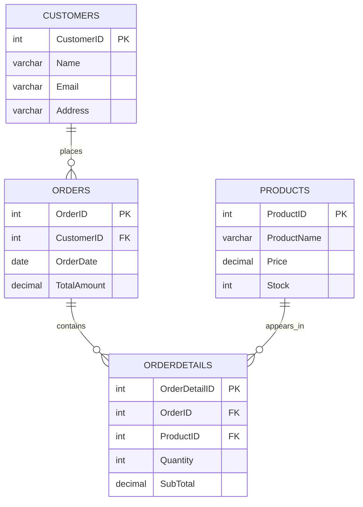

### Table summary

| Table | Purpose | Main fields |
|---|---|---|
| `Customers` | Stores customer information | `CustomerID`, `Name`, `Email`, `Address` |
| `Orders` | Stores customer orders | `OrderID`, `CustomerID`, `OrderDate`, `TotalAmount` |
| `Products` | Stores product and inventory information | `ProductID`, `ProductName`, `Price`, `Stock` |
| `OrderDetails` | Stores the products and quantities in each order | `OrderDetailID`, `OrderID`, `ProductID`, `Quantity`, `SubTotal` |

---

## ✨ Project Highlights

- Created a relational database with four connected tables.
- Used primary keys to identify records and foreign keys to connect related data.
- Practiced `INSERT`, `SELECT`, `UPDATE`, and `DELETE` statements.
- Queried data using filters, sorting, and date conditions.
- Used aggregate functions including `SUM()`, `COUNT()`, `AVG()`, `MAX()`, and `MIN()`.
- Used joins and grouping to explore order and product data.

---

## 📸 Screenshots & Query Evidence

The project screenshots are stored in the repository folder alongside the SQL script.

### Customers

Customer-table and customer-query examples:

<p>
  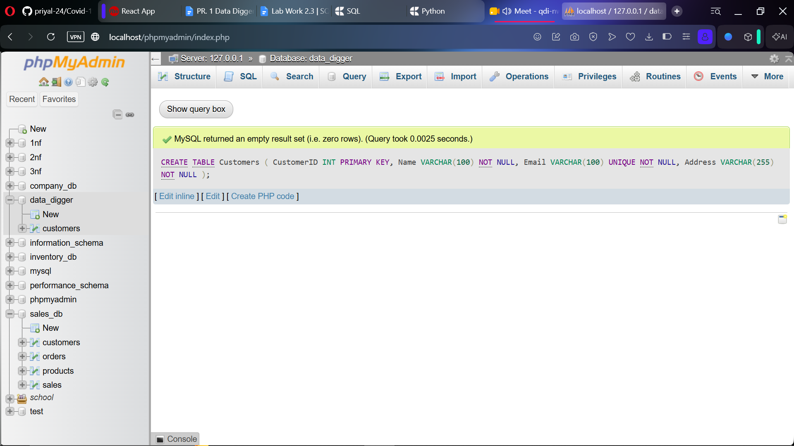
</p>

<p>
  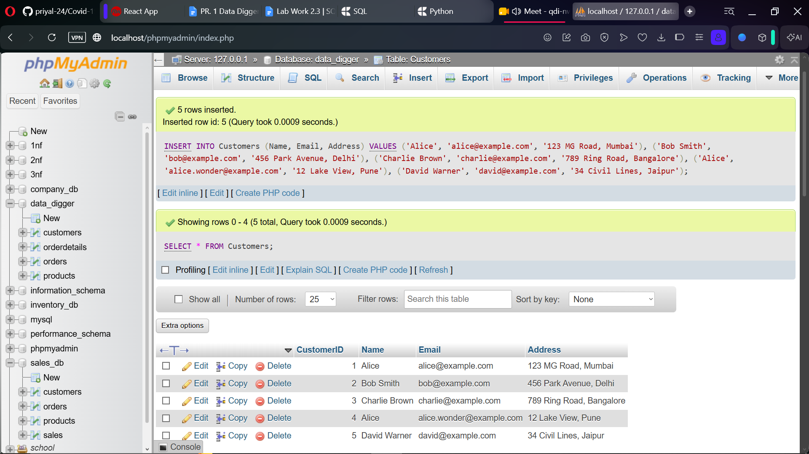
</p>

<p>
  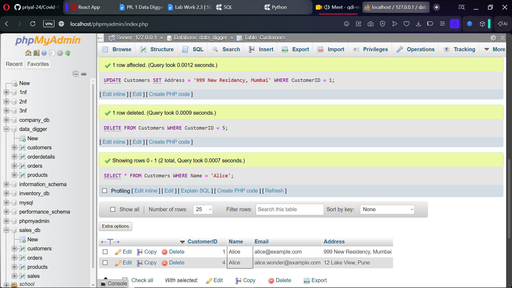
</p>

### Orders

Order-query examples:

<p>
  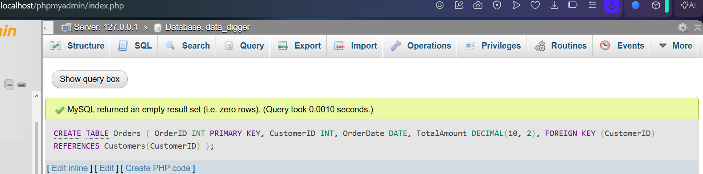
</p>

<p>
  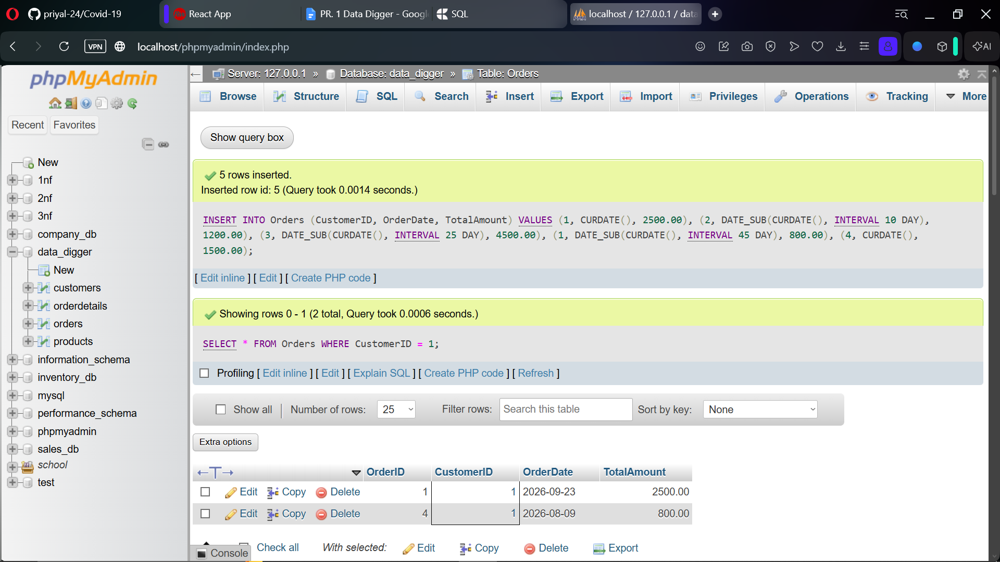
</p>

<p>
  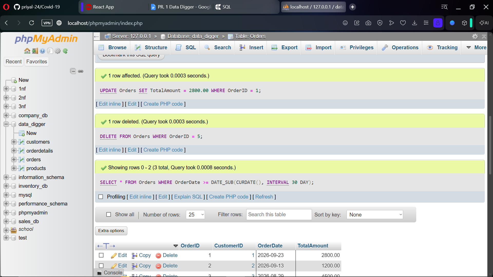
</p>

### Products

Product-query examples:

<p>
  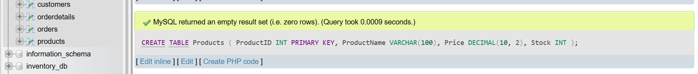
</p>

<p>
  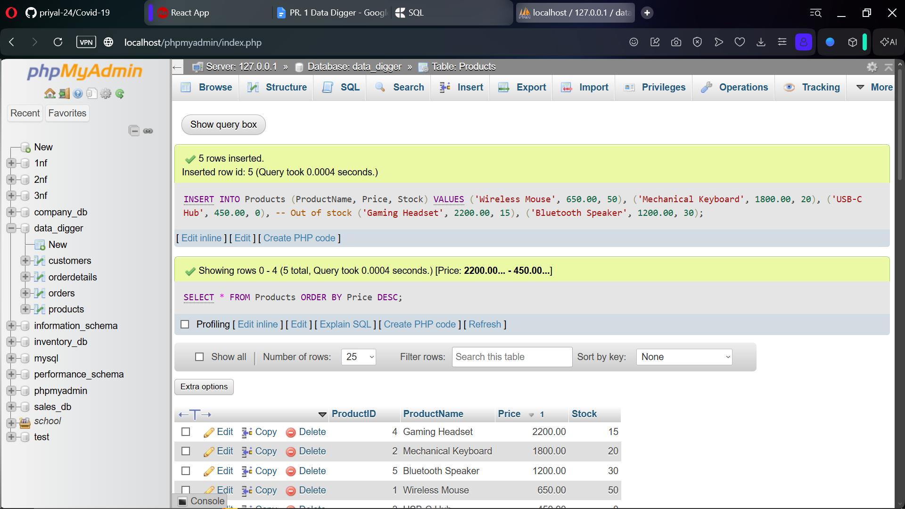
</p>

<p>
  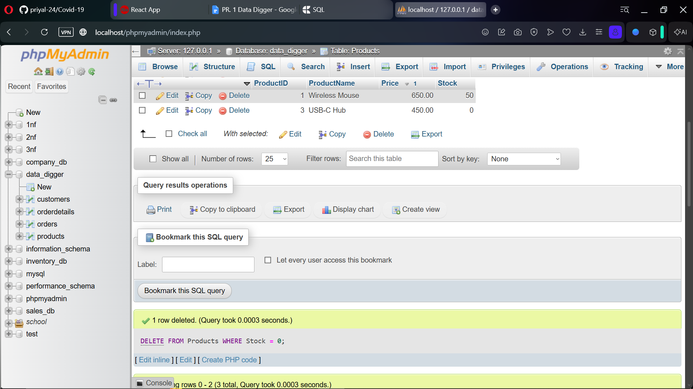
</p>

### Order Details

Order-detail query examples:

<p>
  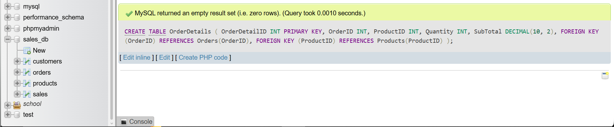
</p>

<p>
  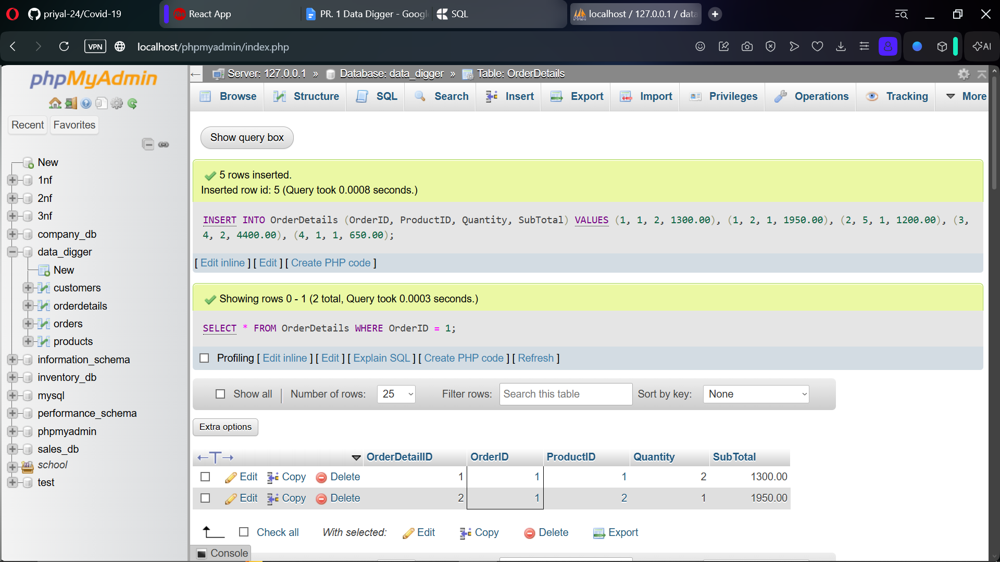
</p>

<p>
  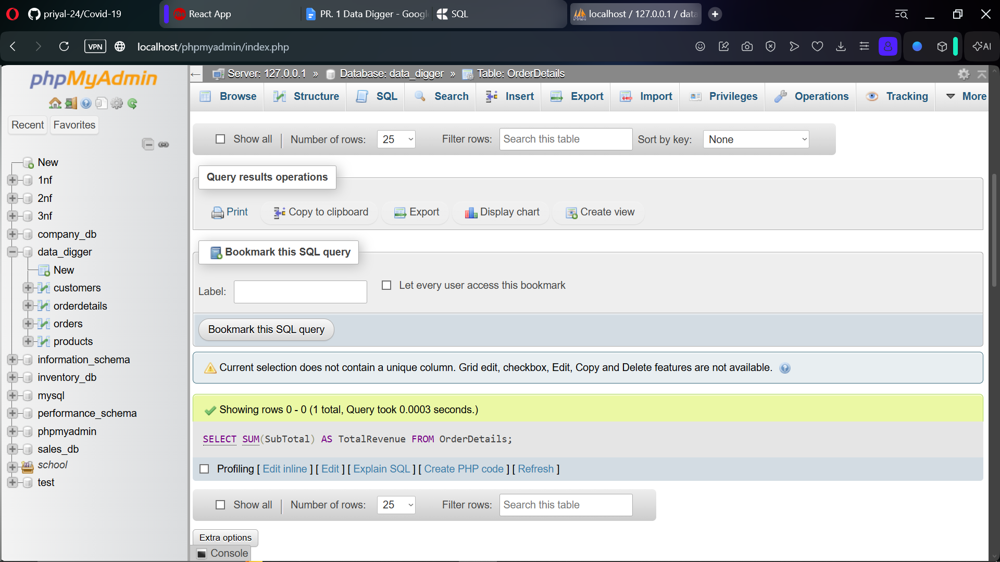
</p>

> More query screenshots are included in the project folder.

---

## 🧪 SQL Tasks

### Customers

- Insert sample customer records.
- Retrieve customer details.
- Update a customer's address.
- Delete a customer using their `CustomerID`.
- Find customers with a specified name, such as `Alice`.

### Orders

- Insert sample orders.
- Find orders belonging to a specific customer.
- Update an order's total amount.
- Delete an order using its `OrderID`.
- Find orders placed in the last 30 days.
- Calculate the highest, lowest, and average order amounts.

### Products

- Insert sample products.
- Display products sorted by price, from highest to lowest.
- Update a product's price.
- Find products that are out of stock.
- Find products priced between ₹500 and ₹2,000.
- Identify the most expensive and least expensive products.

### Order Details

- Insert sample order-detail records.
- Retrieve the details for a specific order.
- Calculate total revenue.
- Find the three most-ordered products.
- Count how many times a particular product appears in order details.

Example: find the three most-ordered products:

```sql
SELECT
    p.ProductName,
    SUM(od.Quantity) AS TotalSold
FROM OrderDetails AS od
JOIN Products AS p
    ON p.ProductID = od.ProductID
GROUP BY p.ProductID, p.ProductName
ORDER BY TotalSold DESC
LIMIT 3;
```

---

## 🧰 Tools and SQL Concepts

**Tools:** MySQL, MySQL Workbench and/or phpMyAdmin

**Concepts practiced:**

- Relational database design
- Primary keys and foreign keys
- Data Definition Language (DDL)
- Data Manipulation Language (DML)
- CRUD operations
- `WHERE`, `BETWEEN`, and `ORDER BY`
- Joins and `GROUP BY`
- Aggregate functions
- Date filtering with `CURDATE()` and `DATE_SUB()`

---

## 🚀 Getting Started

### Requirements

- MySQL Server
- MySQL Workbench, phpMyAdmin, or the MySQL command-line client

### Run the project

1. Download or clone this repository.
2. Open the project folder.
3. Open **`PR-1.sql`** in your SQL client.
4. Execute the script using your MySQL server.
5. Check that the database and tables were created, then run the queries.

If using the MySQL command line, run:

```bash
mysql -u your_username -p < PR-1.sql
```

> Replace `your_username` with your MySQL username. If your SQL file does not create or select the database automatically, create/select the database in your SQL client before running it.

---

## 📁 Project Structure

```text
Data-Digger/
├── README.md
├── PR-1.sql
├── Data-Digger-Demo.mp4
├── CustomerTable.png
├── CustomerQuery1.png
├── CustomerQuery2.png
├── Order1.png
├── Order2.png
├── Order3.png
├── Order4.png
├── ProductQuery1.png
├── ProductQuery2.png
├── ProductQuery3.png
├── ProductQuery4.png
├── OrderdetailsQuery1.png
├── OrderdetailsQuery2.png
├── OrderdetailsQuery3.png
├── OrderdetailsQuery4.png
└── OrderdetailsQuery5.png
```

---

## 👩‍💻 Author

**Priyal Patel**  
GitHub: [@priyal-24](https://github.com/priyal-24)

**Course:** SQL & Database Management 

---

<p align="center">
  <i>Built with curiosity, SQL, and a passion for learning.</i>
</p>